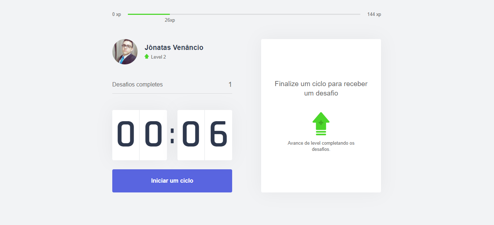

<h1 align='center'>MoveIT</h1>

Um aplicativo desenvolvido para quem passa horas e horas na frente da tela de um computador ou até mesmo do notebook. 
Um aplicativo que carrega a mesma ideia de um pomodoro, porém, a cada tempo completado e a cada desafio concluído, o usuário irá ganhar xp e avançar assim para um próximo nível.

## 🚀 Tecnologias

✅ NextJs  
✅ TypeScript  
✅ CSS3 Module  
✅ js-cookie  
✅ React  
✅ React-dom  

## 📖 Tutorial

Para instalar às dependências basta rodar o comando <strong>yarn install</strong>, que ele irá instalar todas as dependências utilizado no projeto. Após instalado todas as dependências, basta rodar o <strong>yarn dev</strong> e acessar o <strong>localhost:3000</strong> no browser

